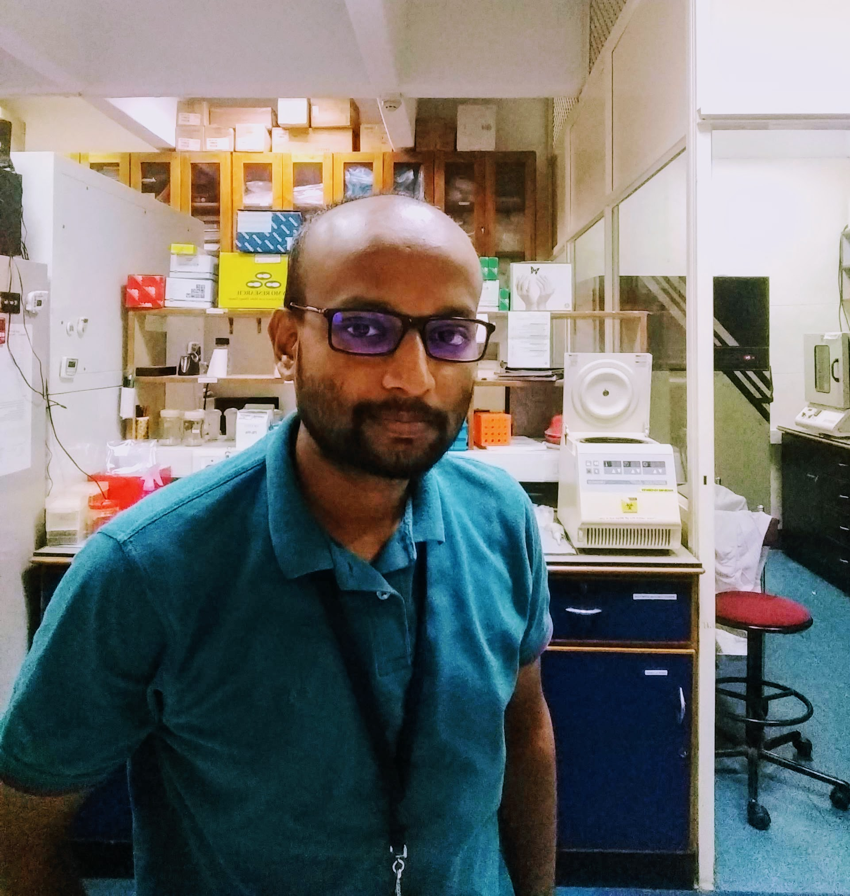

### Budhaditya Basu

::: {.floatting}

```{r out.width='50%', echo= FALSE, out.extra='style="float:right; padding:10px"'}

```

<p align = "justify">I am a senior research fellow at Neuro-Stem Cell Biology Lab in the Department of Regenerative Biology, Rajiv Gandhi Centre for Biotechnology. My research work focuses on the back-splicing events in mammalian retina and its role in axon guidance.<br><br> I code for biological data analysis, visualization as well as statistics. I use cluster computer for handling big data like bulk RNA-Seq data as well as single-cell RNA-Seq data. I am an avid R enthusiast.<br><br>Periodically I use vector graphics tool like adobe illustrator for scientific illustration and sketching graphical abstract.
When I am not in lab, I read books and articles on history and economics. I am an ardent listener of shastriya sangeet. I love to play badminton.<br><br>
I want to pursue the domain that amalgamates machine learning, genomics and neuroscience after my doctoral studies.</p>

:::
<br><br>
<b>Articles published in RGCB newsletter:</b><br><br>
Connecting the dots:[PULSE_OCT_2019](https://rgcb.res.in/documents/newsletter/PULSE-OCTOBER-2019.pdf)<br><br>
Mind:[PULSE_JULY_2020](https://rgcb.res.in/RGCB-PULSE-JULY-2020/)

