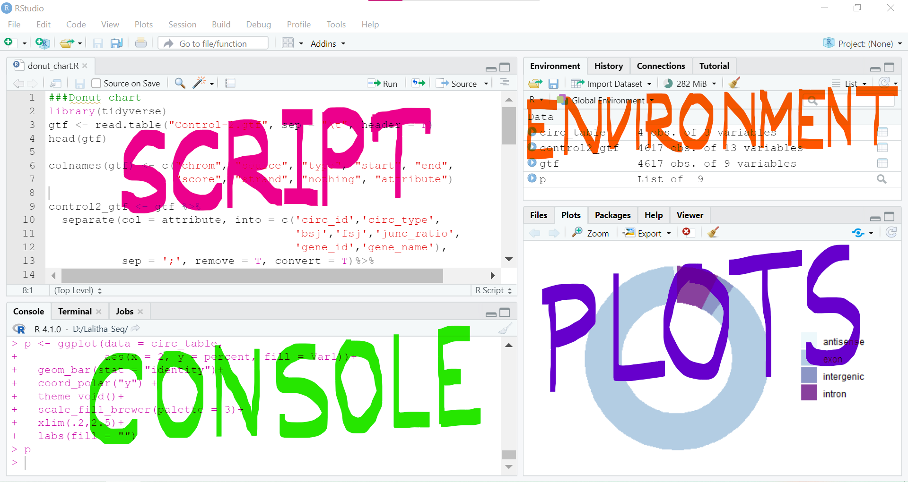
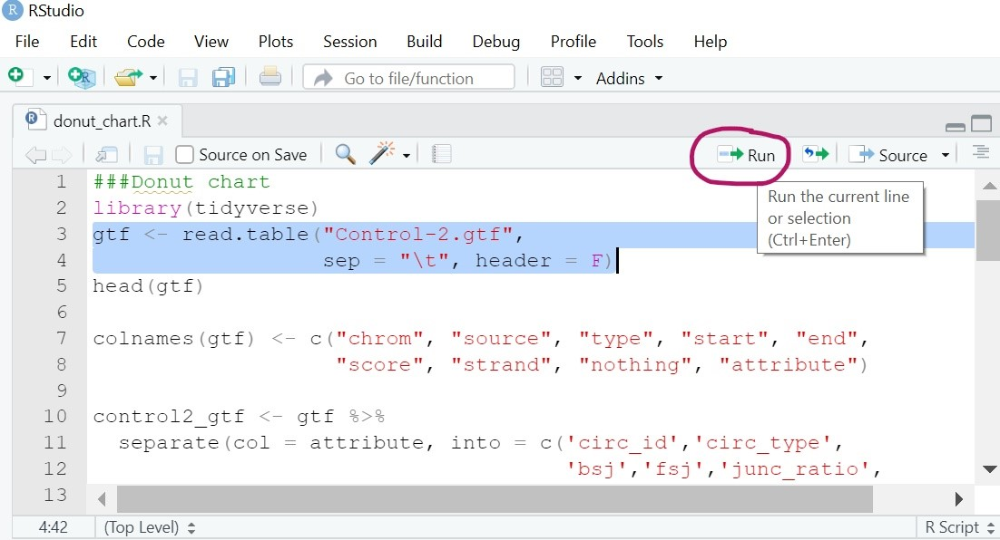
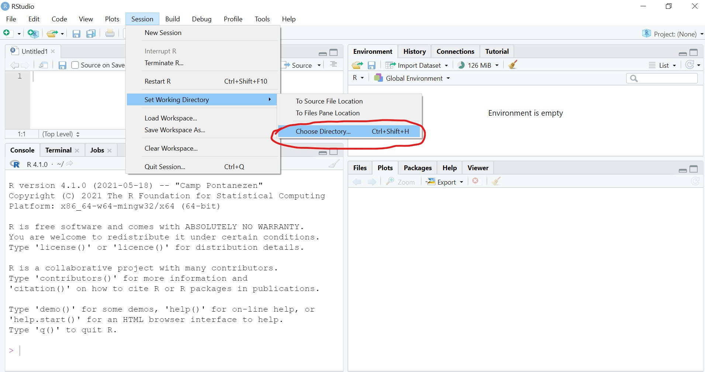
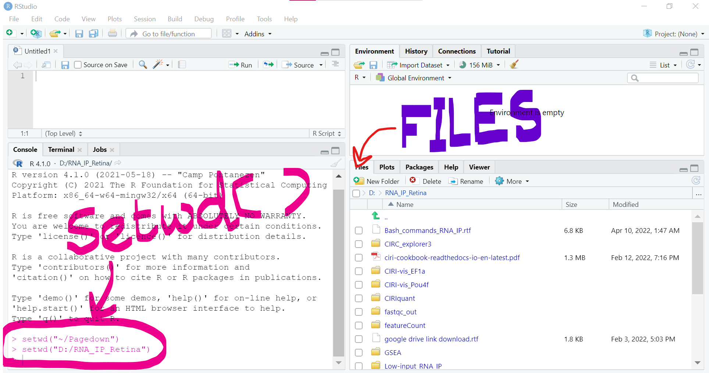
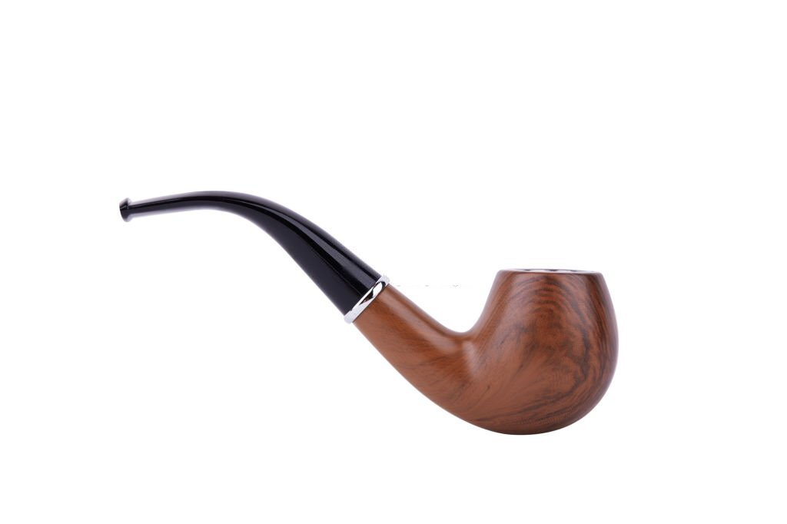
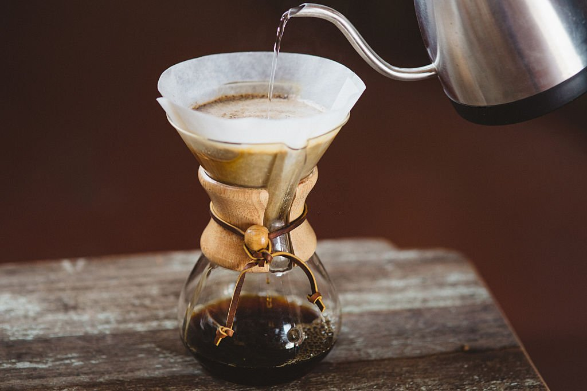

---
output:
  xaringan::moon_reader:
    lib_dir: libs
    nature:
      highlightStyle: github
      highlightLines: true
      countIncrementalSlides: true
---

```{r xaringanExtra, echo=FALSE}
xaringanExtra::use_xaringan_extra(c("panelset", "tachyons",
                                    "extra_styles", "clipboard"))
xaringanExtra::use_extra_styles(
  hover_code_line = TRUE,         
  mute_unhighlighted_code = TRUE  
)

xaringanExtra::use_fit_screen()

```

class: center, bottom
background-image: url("start.jpg")
<span style="font-size: 50pt; ">See What You R</span> <br><br>
<span style="font-size: 20pt; ">Budhaditya Basu</span>


---

class: center, middle

.footnote[
```{r, echo= FALSE}
fontawesome::fa("r-project", fill = "steelblue", height = "30px", width = "35px")
```
]

# R is a language and environment <br>generally used for

--

Data Analysis

--

Data Visualization

--

Statistics

--

Making professional CV/Resume

--

Visual Blogs

--

Professional Website

--

Academic Paper/Book writing

--

And many more..

---

# What is R for a Biologist?

.footnote[
```{r, echo= FALSE}
fontawesome::fa("r-project", fill = "steelblue", height = "30px", width = "35px")
```
]

--

.dark-pink[Highthroughput data analysis]

- RNA-Seq, ChIP-Seq etc.
- Single-cell RNA-Seq
- Proteomics study

--

.dark-pink['Out-of-the-box' plotting capabilities]

- Better representation of data
- Better insights of complex data
- Interesting data visualization

--

.dark-pink[Hundreds of .underline['Bioconductor'] packages for biological data analysis]

- An open source platform for R packages related to biological data analysis

---

class: center, middle

<span style="font-size: 90pt; color: steelblue ">1.  Install R </span>
--


```{r, echo= FALSE}
fontawesome::fa("r-project", fill = "steelblue")
```
=
```{r, echo= FALSE}
fontawesome::fa("heart", fill = "red")
```


--

Install **R** from R project homepage:
https://cran.r-project.org/

--


You are recommended to use the [RStudio IDE](https://www.rstudio.com/products/rstudio/) 


---

# Rstudio has four main panels

--



---

# Rstudio has four main panels

--

- .dark-pink[Scripts] are the records of codes (like a recipe)

--

- .dark-pink[Console] is the place where a code is executed (cooking)

--

- .dark-pink[Environment] is like a kitchen where ingredients (data) and finished dishes (output) can be found.

--

- .dark-pink[Files] are the ingredients and .dark-pink[packages] are like tools (saucepan) in a kitchen.


---

# How to execute a code?

--

- To execute a line of code where cursor currently resides, press <br> **Ctrl + Enter** or use **Run** toolbar button

--



--

- Multiple lines of code can be selected and executed by similar way.

---

class: center, middle
# Set the working directory

.footnote[
```{r, echo= FALSE}
fontawesome::fa("r-project", fill = "steelblue", height = "30px", width = "35px")
```
]

--

Before running any code, we need to set the working directory.

--

Go to .dark-blue[Session > Set Working Directory > Choose Directory]

--



---

class: center, middle
# Set the working directory

.footnote[
```{r, echo= FALSE}
fontawesome::fa("r-project", fill = "steelblue", height = "30px", width = "35px")
```
]

Alternatively, we can set the working directory by using <br> `setwd("path to directory")`

--



---
class: center, middle
# Get Started

.footnote[
```{r, echo= FALSE}
fontawesome::fa("r-project", fill = "steelblue", height = "30px", width = "35px")
```
]

--

Open R Studio

--

.dark-blue[File > New File > R Script]

---

#Variable Assignment

.footnote[
```{r, echo= FALSE}
fontawesome::fa("r-project", fill = "#E33D85", height = "30px", width = "35px")
```
]

--

.pull-left[
```{r}
num <- 2
```

- `num` holds the value 2

]

--

.pull-right[

- Here, `num` is a <span style="color: deeppink;"> "variable"</span>

- <- is <span style="color: deeppink;">"assignment operator"</span>


]


--

.pull-left[

Now, if we execute the variable `num`, it will return the value 2

]

--

.pull-right[

```{r}
num
```

]

--
.pull-left[

```{r}
150 -> fruits

fruits
```
]

--
.pull-right[

- Both operators are same.

- Simply "left-form" and "right-form"

]


---

#Variable types in R

.footnote[
```{r, echo= FALSE}
fontawesome::fa("r-project", fill = "#E33D85", height = "30px", width = "35px")
```
]

--

- <span style="color: blue;">int</span> for integers.

- <span style="color: blue;">dbl</span> for doubles or real numbers.

- <span style="color: blue;">chr</span> for character

- <span style="color: blue;">dttm</span> for date-time

- <span style="color: blue;">lgl</span> for logical vectors like TRUE or FALSE

- <span style="color: blue;">fct</span> for categorical variables


---

#Convention for naming variables

.footnote[
```{r, echo= FALSE}
fontawesome::fa("r-project", fill = "#E33D85", height = "30px", width = "35px")
```
]

--

.pull-left[

```{r}
my_name <- "Budhaditya"

my_weight <- 66.678

print(my_name)

```

]

--
.pull-right[

- It cannot include <span style="color: deeppink;">space</span>. <br><br>
  e.g. <span style="color: blue;">"my name"</span> is not valid. But <br><br><span style="color: blue;">"my_name"</span> or <span style="color: blue;">"my.name"</span> is perfect
 ] 

--
.pull-left[

```{r}
"cat" == "cat"
"cat" == "CAT"
```
]

--
.pull-right[
<br><br><br><br>
- Variable is <span style="color: deeppink;">case sensitive</span>.

]

---

#Vector

.footnote[
```{r, echo= FALSE}
fontawesome::fa("r-project", fill = "#E33D85", height = "20px", width = "20px")
```
]

--
.pull-left[
```{r}
my_value <- c(1, 3, 9, 27)

my_value
```
]

--
.pull-right[
- Variable that stores multiple values are <span style="color: deeppink;">"Vector"</span> 

- c ( ) is called <span style="color: deeppink;">"Combine function"</span>
]
--

.pull-left[

```{r}
my_value[3]
```

]

--
.pull-right[

- Square brackets [] identify the position within a vector **(index)**

- This index can be used to extract relevant values

]

--

.pull-left[

```{r}
my_value[3] <- "gene"

my_value
```

]
--

.pull-right[

- **Index** can be used to modify the vector
]

---

class: center, middle
<span style="font-size: 90pt; color: steelblue; ">2.  Packages </span>


---

#Installing and Loading of Packages

.footnote[
```{r, echo= FALSE}
fontawesome::fa("r-project", fill = "#E33D85", height = "30px", width = "35px")
```
]


--

- Packages extend the capabilities of <span style="font-size: 15pt; color: deeppink; "> R </span>

--

- <span style="font-size: 15pt; color: deeppink; "> "Installing" </span> is downloading the package into your computer.

--

- <span style="font-size: 15pt; color: deeppink; "> "Loading" </span> is telling R to use it.

<br>
--

- ...you need to <span style="font-size: 15pt; color: deeppink; "> "install" </span> a package only once.


--

- ...but you have to <span style="font-size: 15pt; color: deeppink; "> "load" </span> it every time.

<br>
--

- <span style="font-size: 15pt; color: deeppink; "> "Install" </span> using `install.packages()`

--

- <span style="font-size: 15pt; color: deeppink; "> "Load" </span> using `library()`


---

class: center, middle
background-image: url("thoughts.jpg")
background-size: cover

#...Time for break

---

#R Packages

.footnote[
```{r, echo= FALSE}
fontawesome::fa("r-project", fill = "#E33D85", height = "30px", width = "35px")
```
]

--

- "Packages" are collection of functions and data sets

--

- <span style="font-size: 15pt; color: deeppink; "> "dplyr" </span> is used for data manipulation.

--

- <span style="font-size: 15pt; color: deeppink; "> "ggplot2" </span> for data visualization.

--

- <span style="font-size: 15pt; color: deeppink; "> "tidyverse" </span> is a bundle of 8 packages together. <br>

--

```{r, out.width='60%', out.height= '50%', fig.align='center', fig.cap='', echo=FALSE}
knitr::include_graphics('tidyverse_packages.png')

```
---

#R function

.footnote[
```{r, echo= FALSE}
fontawesome::fa("r-project", fill = "#E33D85", height = "30px", width = "35px")
```
]

--

- <span style="font-size: 15pt; color: deeppink; "> "Functions" </span> are meant for doing calculation.

--
.pull-left[
```{r}
sqrt(25)
log2(8)
round(x = 3.141592, digits = 2)
```

]
--
<br><br>
.pull-right[
- `sqrt()`, `log2()` or `round()` are the examples of <span style="font-size: 15pt; color: deeppink; "> functions </span><br><br>


- (<span style="font-size: 15pt; color: seagreen; "> "Arguments" </span>) are kept within the parentheses.<br><br> 
- If multiple arguments present, that must be separated by comma.
]

---

class: inverse, center, middle
background-image: url('data.jpg')
<span style="font-size: 90pt; color: white; ">3.  Data Frames </span>


---
#Data Frames

.footnote[
```{r, echo= FALSE}
fontawesome::fa("r-project", fill = "#E33D85", height = "30px", width = "35px")
```
]


--

.pull-left[


`install.packages("palmerpenguins")`


```{r, message=FALSE, warning=FALSE}
library(palmerpenguins)

df <- penguins #<<
```


<br><br>
- `penguins` data set is assigned to the variable named `df`

]
---
#Data Frames

.footnote[
```{r, echo= FALSE}
fontawesome::fa("r-project", fill = "#E33D85", height = "30px", width = "35px")
```
]


- `head()` function shows first few rows of the data frame `df`


--


```{r, eval=FALSE}
head(df)
```


---

#Data Frames

.footnote[
```{r, echo= FALSE}
fontawesome::fa("r-project", fill = "#E33D85", height = "30px", width = "35px")
```
]
--


.pull-left[

```{r}
df[1, 3]
```

]

--

.pull-right[

- Give me the value stored in <span style="font-size: 15pt; color: deeppink; "> first row, third column</span> of `df`
]

---

#Data Frames

.footnote[
```{r, echo= FALSE}
fontawesome::fa("r-project", fill = "#E33D85", height = "30px", width = "35px")
```
]

- Give me the values of <span style="font-size: 15pt; color: deeppink; "> first row</span> of `df` (all columns)


```{r, eval=FALSE}
df[1,]
```

---

#Data Frames

.footnote[
```{r, echo= FALSE}
fontawesome::fa("r-project", fill = "#E33D85", height = "30px", width = "35px")
```
]

--

.pull-left[
```{r}
df[,3]
```
]
--

.pull-right[
- Give me the values of <span style="font-size: 15pt; color: deeppink; "> third column </span> of `df` (all rows)
]

---

#Data Frames

.footnote[
```{r, echo= FALSE}
fontawesome::fa("r-project", fill = "#E33D85", height = "30px", width = "35px")
```
]

--
.pull-left[
```{r}
df[1:2, 2:4]
```

]

--

.pull-right[

- Give me the values of <span style="font-size: 15pt; color: deeppink; "> rows 1-2 and columns 2-4 </span> of `df` (all rows)
]

---

#Data Frames

.footnote[
```{r, echo= FALSE}
fontawesome::fa("r-project", fill = "#E33D85", height = "30px", width = "35px")
```
]
--
.pull-left[
```{r}
df[, "island"]
```

]

--

.pull-right[

- Prints the data stored in "island" column

]
---

#Pipe &nbsp;&nbsp;&nbsp;%>%

.footnote[
```{r, echo= FALSE}
fontawesome::fa("r-project", fill = "#E33D85", height = "30px", width = "35px")
```
]

--

.pull-left[

- We <span style="font-size: 15pt; color: deeppink; "> "pipe" </span> our data through several functions.

- The data set flows through the cascade of operations

```{r, out.width='70%', fig.align='center', fig.cap='', echo=FALSE}


```
]

--

.pull-right[
```{r,message=FALSE, warning=FALSE}
library(tidyverse)

df %>%
  group_by(species) %>%
  drop_na()%>%
  summarize(mean(bill_length_mm))
```
]

--

```{r, out.width='35%', fig.align='center', fig.cap='', echo=FALSE}
knitr::include_graphics('culmen_depth.png')

```


---

class: inverse, center, middle
background-image: url('tidy.jpg')
<span style="font-size: 90pt; color: white; ">4.  Tidying Data </span>


---

#dplyr verbs

.footnote[
```{r, echo= FALSE}
fontawesome::fa("r-project", fill = "#E33D85", height = "30px", width = "35px")
```
]

--
.pull-left[
- `select()` <span style="color: deeppink; "> << </span>

- `select()` function selects only user defined columns from a data frame

<br><br>
```{r, out.width='35%', fig.align='center', fig.cap='', echo=FALSE}
knitr::include_graphics('dplyr_logo.png')

```
]

--

.pull-right[
```{r, message=FALSE, warning=FALSE}
iris %>%
  select(Sepal.Length, #<<
         Petal.Width)%>%#<<
  head()
```

]

---

#dplyr verbs

.footnote[
```{r, echo= FALSE}
fontawesome::fa("r-project", fill = "#E33D85", height = "30px", width = "35px")
```
]

--
.pull-left[
- `select()`
- `filter()` <span style="color: deeppink; "> << </span>

- `filter()` function helps to subset a data frame that satisfy a user defined condition.
<br><br>
```{r, out.width='100%', out.height= '100%', fig.align='center', fig.cap='', echo=FALSE}


```
]

--

.pull-right[
```{r, message=FALSE, warning=FALSE}
iris %>%
  select(Sepal.Length, 
         Petal.Width)%>%
  filter(Petal.Width > 2.3)#<<
```

]

---

#dplyr verbs

.footnote[
```{r, echo= FALSE}
fontawesome::fa("r-project", fill = "#E33D85", height = "30px", width = "35px")
```
]

--
.pull-left[
- `select()`
- `filter()`
- `arrange()` <span style="color: deeppink; "> << </span>
<br><br><br>
- It arranges low to high
]

--

.pull-right[
```{r, message=FALSE, warning=FALSE}
iris %>%
  select(Sepal.Length, 
         Petal.Width)%>%
  filter(Petal.Width > 2.3)%>%
  arrange(Petal.Width)#<< 
```

]

---
#dplyr verbs

.footnote[
```{r, echo= FALSE}
fontawesome::fa("r-project", fill = "#E33D85", height = "30px", width = "35px")
```
]

--
.pull-left[
- `select()`
- `filter()`
- `arrange(desc())` <span style="color: deeppink; "> << </span>
<br><br><br>
- It arranges high to low
]

--

.pull-right[
```{r, message=FALSE, warning=FALSE}
iris %>%
  select(Sepal.Length, 
         Petal.Width)%>%
  filter(Petal.Width > 2.3)%>%
  arrange(desc(Petal.Width))#<< 
```

]
---

#dplyr verbs

.footnote[
```{r, echo= FALSE}
fontawesome::fa("r-project", fill = "#E33D85", height = "30px", width = "35px")
```
]

--
.pull-left[
- `select()`
- `filter()`
- `arrange(desc())` 
- `rename()` <span style="color: deeppink; "> << </span>
<br><br><br>
- It renames the column name
]

--

.pull-right[
```{r, message=FALSE, warning=FALSE}
iris %>%
  select(Sepal.Length, Petal.Width)%>%
  filter(Petal.Width > 2.3)%>%
  arrange(desc(Petal.Width))%>%
  rename(petal_width = Petal.Width,  #<<
         sepal_length = Sepal.Length)#<< 
```

]

---

#dplyr verbs

.footnote[
```{r, echo= FALSE}
fontawesome::fa("r-project", fill = "#E33D85", height = "30px", width = "35px")
```
]

--
.pull-left[
- `select()`
- `filter()`
- `arrange(desc())` 
- `rename()` 
- `mutate()` <span style="color: deeppink; "> << </span>
<br><br><br>
- It creates one or more column
]

--

.pull-right[
```{r, message=FALSE, warning=FALSE}
iris %>%
  select(Petal.Length, Petal.Width)%>%
  filter(Petal.Width > 2.3)%>%
  arrange(desc(Petal.Width))%>%
  rename(petal_width = Petal.Width,  
         petal_length = Petal.Length)%>%
  mutate(petal = petal_width + petal_length)#<< 
```

]

---

#dplyr verbs

.footnote[
```{r, echo= FALSE}
fontawesome::fa("r-project", fill = "#E33D85", height = "30px", width = "35px")
```
]

--
.pull-left[
- `select()`
- `filter()`
- `arrange(desc())`
- `rename()` 
- `mutate()`
- `summarise()`<span style="color: deeppink; "> << </span>
]

---

#dplyr verbs

.footnote[
```{r, echo= FALSE}
fontawesome::fa("r-project", fill = "#E33D85", height = "30px", width = "35px")
```
]

```{r, message=FALSE, warning=FALSE}
penguins %>%
  group_by(species) %>%
  drop_na()%>%
  select(bill_length_mm, body_mass_g, flipper_length_mm)%>%
  summarize(across(everything(), mean))#<<
```

- across() function used as nested function here to apply summarize() function to multiple column<br><br>
- everything() used here for selecting all variables/columns 

---

#dplyr verbs

.footnote[
```{r, echo= FALSE}
fontawesome::fa("r-project", fill = "#E33D85", height = "30px", width = "35px")
```
]

--
.pull-left[
- `select()`
- `filter()`
- `arrange(desc())`
]

.pull-right[
- `rename()` 
- `mutate()`
- `summarise()`
- `join()`<span style="color: deeppink; "> << </span>

]

--
.pull-left[
```{r, message=FALSE, warning=FALSE}
df1 <- data.frame(
  Gene = c("gene1",
           "gene2",
           "gene3"),
  Sample1 = c(5, 6, 13))
df1
```
]

--
.pull-right[
```{r, message=FALSE, warning=FALSE}
df2 <- data.frame(
  Gene = c("gene1",
           "gene2",
           "gene3"),
  Sample2 = c(15, 38, 3))
df2
```
]


---
#dplyr verbs

.footnote[
```{r, echo= FALSE}
fontawesome::fa("r-project", fill = "#E33D85", height = "30px", width = "35px")
```
]

--
.pull-left[
- `select()`
- `filter()`
- `arrange(desc())`
]

.pull-right[
- `rename()` 
- `mutate()`
- `summarise()`
- `join()`<span style="color: deeppink; "> << </span>

]

```{r, message=FALSE, warning=FALSE}
full_join(df1, df2, by = "Gene")
```


---

#Changing rownames to column with dplyr

.footnote[
```{r, echo= FALSE}
fontawesome::fa("r-project", fill = "#E33D85", height = "30px", width = "35px")
```
]

--

```{r, message=FALSE, warning=FALSE}
data <- datasets::USArrests
head(data, 2)

data <- USArrests %>%
  rownames_to_column(var = "State")#<<
head(data, 2)
```


---

#Reshaping data with tidyr

.footnote[
```{r, echo= FALSE}
fontawesome::fa("r-project", fill = "#E33D85", height = "30px", width = "35px")
```
]

--
.pull-left[

- `gather()` <span style="color: deeppink; "> << </span>
- `gather()` makes "wide" data longer
<br><br>
```{r, out.width='35%', fig.align='center', fig.cap='', echo=FALSE}
knitr::include_graphics('tidyr.png')

```
]

--
.pull-right[
```{r, message=FALSE, warning=FALSE}
tidy_data <- gather( #<<
  data = data,
  key = "Crime",
  value = "Estimate",
  - State)
head(tidy_data)
```
]

---

#Reshaping data with tidyr

.footnote[
```{r, echo= FALSE}
fontawesome::fa("r-project", fill = "#E33D85", height = "30px", width = "35px")
```
]

--
.pull-left[

- `gather()`
- `spread()` <span style="color: deeppink; "> << </span>
- `spread()` makes "long" data wider
<br><br>
```{r, out.width='35%', fig.align='center', fig.cap='', echo=FALSE}
knitr::include_graphics('tidyr.png')

```
]

--
.pull-right[
```{r, message=FALSE, warning=FALSE}
orig_data <- spread( #<<
  data = tidy_data,
  key = "Crime",
  value = "Estimate")

head(orig_data[,1:3])
```
]
---

#Data Import and Export using readr

.footnote[
```{r, echo= FALSE}
fontawesome::fa("r-project", fill = "#E33D85", height = "30px", width = "35px")
```
]

--

.pull-left[
```{r, out.width='30%', fig.align='center', fig.cap='', echo=FALSE}
knitr::include_graphics('readr.png')
```

- `read_csv()` is used for data importing into R environment.

- `write_csv()` is meant for saving any data frame as csv file into the current working directory. 
]


--

.pull-right[
```{r, eval=FALSE}
library(readr)

file <- read_csv( #<<
  "filename.csv")

write_csv(x = data,#<<
          file = "filename.csv")
```

]

---

#Data Import and Export using readxl

.footnote[
```{r, echo= FALSE}
fontawesome::fa("r-project", fill = "#E33D85", height = "30px", width = "35px")
```
]

.pull-left[
```{r, out.width='30%', fig.align='center', fig.cap='', echo=FALSE}
knitr::include_graphics('readxl.png')
```


- `read_xlsx()` is used for data importing into R environment.
]

--

.pull-right[
```{r, eval=FALSE}
library(readxl)

file <- read_xlsx( #<<
  "filename.xlsx")

```

]


---

class: center, middle
background-image: url("break.jpg")
background-size: cover

---

class: inverse, center, middle
background-image: url('viz1.jpg')
<span style="font-size: 90pt; color: white; ">5.  Data Visualization </span>

---

#Data Visualization with {ggplot2}

.footnote[
```{r, echo= FALSE}
fontawesome::fa("r-project", fill = "#E33D85", height = "30px", width = "35px")
```
]

.pull-left[
```{r, out.width='35%', fig.align='center', fig.cap='', echo=FALSE}
knitr::include_graphics('ggplot.png')
```
]

--

.pull-right[
```{r, out.width='100%', out.height='100%', fig.align='center', fig.cap='', echo=FALSE}
knitr::include_graphics('layers.png')
```

- Graphics has distinct layers
]

--
<br><br>
- Resources:: [Introduction to ggplot2](https://englelab.gatech.edu/useRguide/introduction-to-ggplot2.html)
---
#Data Visualization with {ggplot2}

.footnote[
```{r, echo= FALSE}
fontawesome::fa("r-project", fill = "#E33D85", height = "30px", width = "35px")
```
]

.pull-left[
```{r, out.width='100%',out.height='100%', fig.align='center', fig.cap='', echo=FALSE}
knitr::include_graphics('ge_data.png')
```

- Data layer

- It has only got input data. But the ggplot2 does not know what to plot. 

- It returns an empty plot
]

--

.pull-right[
```{r, message=FALSE, warning=FALSE, fig.height=4,fig.width=4}
library(ggplot2)

ggplot(data = penguins)
```

]

---

#Data Visualization with {ggplot2}

.footnote[
```{r, echo= FALSE}
fontawesome::fa("r-project", fill = "#E33D85", height = "30px", width = "35px")
```
]

.pull-left[
```{r, out.width='100%',out.height='100%', fig.align='center', fig.cap='', echo=FALSE}
knitr::include_graphics('ge_aes.png')
```

- Aesthetic Layer

- X and Y coordinates are defined
]

--

.pull-right[
```{r, message=FALSE, warning=FALSE, fig.height=4,fig.width=4}
library(ggplot2)

g <- ggplot(data = penguins,
       aes(
         x = flipper_length_mm,
         y = body_mass_g))
g
```

]
---

#Data Visualization with {ggplot2}

.footnote[
```{r, echo= FALSE}
fontawesome::fa("r-project", fill = "#E33D85", height = "30px", width = "35px")
```
]

.pull-left[
```{r, out.width='100%',out.height='100%', fig.align='center', fig.cap='', echo=FALSE}
knitr::include_graphics('ge_geom.png')
```

- Geometries Layer
- Here, we define what kind of plot we want (boxplot, histogram etc.)
]

--

.pull-right[
```{r dpi=300, message=FALSE, warning=FALSE, fig.height=4,fig.width=4}
g + geom_point()#<<
```

]
---

#Data Visualization with {ggplot2}

.footnote[
```{r, echo= FALSE}
fontawesome::fa("r-project", fill = "#E33D85", height = "30px", width = "35px")
```
]

.pull-left[
```{r, out.width='100%',out.height='100%', fig.align='center', fig.cap='', echo=FALSE}
knitr::include_graphics('ge_facet.png')
```

- Facet wrapping creates subplots
]

--

.pull-right[
```{r dpi=300, message=FALSE, warning=FALSE, fig.height=4,fig.width=8}
g + geom_point()+
  facet_wrap(~ species)#<<
```

]
---

#Data Visualization with {ggplot2}

.footnote[
```{r, echo= FALSE}
fontawesome::fa("r-project", fill = "#E33D85", height = "30px", width = "35px")
```
]


--


```{r dpi=300, message=FALSE, warning=FALSE, fig.height=4,fig.width=10}
g + geom_point(aes(color = sex))+#<<
  facet_wrap(~ species)
```

---

#Themes

.footnote[
```{r, echo= FALSE}
fontawesome::fa("r-project", fill = "#E33D85", height = "30px", width = "35px")
```
]

```{r dpi=300, echo=FALSE, warning=FALSE, message=FALSE, fig.height=6,fig.width=12}
library(cowplot)
p1 <- g + geom_point(aes(color = sex))+
  facet_wrap(~ species)+ theme_bw()+
  labs(title = "theme_bw()")+
  theme(legend.position = "none",
        plot.title = element_text(size=22))
p2 <- g + geom_point(aes(color = sex))+
  facet_wrap(~ species)+ theme_classic()+
  labs(title = "theme_classic")+
  theme(legend.position = "none",
        plot.title = element_text(size=22))
p3 <- g + geom_point(aes(color = sex))+
  facet_wrap(~ species)+ theme_dark()+
  labs(title = "theme_dark()")+
  theme(legend.position = "none",
        plot.title = element_text(size=22))
p4 <- g + geom_point(aes(color = sex))+
  facet_wrap(~ species)+ theme_minimal()+
  labs(title = "theme_minimal()")+
  theme(legend.position = "none",
        plot.title = element_text(size=22))
p5 <- g + geom_point(aes(color = sex))+
  facet_wrap(~ species)+ theme_void()+
  labs(title = "theme_void()")+
  theme(legend.position = "none",
        plot.title = element_text(size=22))
p6 <- g + geom_point(aes(color = sex))+
  facet_wrap(~ species)+ theme_gray()+
  labs(title = "theme_gray()")+
  theme(legend.position = "none",
        plot.title = element_text(size=22))

plot_grid(p1, p2, p3, p4, p5, p6,
          nrow = 2, ncol = 3)

```

---

#Data Visualization with {ggplot2}

.footnote[
```{r, echo= FALSE}
fontawesome::fa("r-project", fill = "#E33D85", height = "30px", width = "35px")
```
]


--


```{r dpi=300, message=FALSE, warning=FALSE, fig.height=4,fig.width=10}
g + geom_point(aes(color = sex))+
  facet_wrap(~ species)+ theme_minimal()#<<
```

---
#Data Visualization with {ggplot2}

.footnote[
```{r, echo= FALSE}
fontawesome::fa("r-project", fill = "#E33D85", height = "30px", width = "35px")
```
]


--


```{r dpi= 600, message=FALSE, warning=FALSE, fig.height=4,fig.width=12}
ggplot(data = penguins %>% drop_na(), #<< 
       aes(x = flipper_length_mm,
           y = body_mass_g)) + geom_point(aes(color = sex))+
  facet_wrap(~ species)+ theme_minimal()
```

---

#Data Visualization with {ggplot2}

.footnote[
```{r, echo= FALSE}
fontawesome::fa("r-project", fill = "#E33D85", height = "30px", width = "35px")
```
]


--


```{r dpi=300, message=FALSE, warning=FALSE, fig.height=4,fig.width=12}
ggplot(data = penguins %>% drop_na(), 
       aes(x = flipper_length_mm,
           y = body_mass_g)) + geom_point(aes(color = sex))+
  facet_wrap(~ species)+ theme_minimal()+
  labs(title = "Penguin flipper and body mass",#<<
       x = "Flipper length (mm)",#renaming x axis
       y = "Body mass (g)",#renaming y axis
       color = "Penguin sex") #renaming legend title
```

---

#Data Visualization with {ggplot2}

.footnote[
```{r, echo= FALSE}
fontawesome::fa("r-project", fill = "#E33D85", height = "30px", width = "35px")
```
]

.panelset[.panel[.panel-name[]
```{r panelset = c(source = "Code", output = "Plot"), fig.height=7,fig.width=17, dpi=300}
ggplot(data = penguins %>% drop_na(), 
       aes(x = flipper_length_mm,
           y = body_mass_g)) + 
  geom_point(aes(color = sex), alpha = 0.50)+
  facet_wrap(~ species)+ theme_minimal()+
  labs(title = "Penguin flipper and body mass",
       x = "Flipper length (mm)",
       y = "Body mass (g)",
       color = "Penguin sex")+
  scale_color_manual(values = c("darkorange","cyan4"))+
  theme(axis.title.x = element_text(size = 20),
        axis.title.y = element_text(size = 20),
        legend.title = element_text(size = 15),
        plot.title = element_text(size = 25))
```
]]

---

#Data Visualization with {ggplot2}

.footnote[
```{r, echo= FALSE}
fontawesome::fa("r-project", fill = "#E33D85", height = "30px", width = "35px")
```
]

```{r echo=FALSE}
p <- ggplot(data = penguins %>% drop_na(), 
       aes(x = flipper_length_mm,
           y = body_mass_g)) + 
  geom_point(aes(color = sex), alpha = 0.50)+
  facet_wrap(~ species)+ theme_minimal()+
  labs(title = "Penguin flipper and body mass",
       x = "Flipper length (mm)",
       y = "Body mass (g)",
       color = "Penguin sex")+
  theme(axis.title.x = element_text(size = 20),
        axis.title.y = element_text(size = 20),
        legend.title = element_text(size = 15),
        plot.title = element_text(size = 25))+
  scale_color_manual(values = c("darkorange","cyan4"))
```


```{r, echo=FALSE}
plot1 <- g + geom_point()+ facet_wrap(~ species)+
  labs(title = "Before")+ theme(plot.title = element_text(size = 22))
plot2 <- p + labs(title = "After")+ theme(plot.title = element_text(size = 22))
```

```{r dpi= 600, message=FALSE, warning=FALSE, fig.height=7.5,fig.width=12, echo=FALSE}
library(cowplot)
plot_grid(plot1, plot2, nrow = 2)

```

---
#Data Visualization with {ggplot2}

.footnote[
```{r, echo= FALSE}
fontawesome::fa("r-project", fill = "#E33D85", height = "30px", width = "35px")
```
]

--


```{r dpi= 600, message=FALSE, warning=FALSE, fig.height=7,fig.width=15}
ggplot(data = penguins, aes(x = species, y = flipper_length_mm))+ 
  geom_boxplot(width = 0.2)+ geom_jitter(width = 0.1)+
  ggdist::stat_halfeye(width = 0.3,justification = - .4)#<<
```


---

#Data Visualization with {ggplot2}

.footnote[
```{r, echo= FALSE}
fontawesome::fa("r-project", fill = "#E33D85", height = "30px", width = "35px")
```
]

.panelset[.panel[.panel-name[]
```{r dpi= 600, message=FALSE, warning=FALSE, fig.height=5,fig.width=12, panelset = c(source = "Code", output = "Plot")}
ggplot(data = penguins, aes(x = species, 
                            y = flipper_length_mm, 
                            fill = species))+
geom_boxplot(width = 0.2, alpha = 0.25,
             aes(color = species) )+ 
  geom_jitter(width = 0.1, size = 2, 
              alpha = 0.25, aes(color = species))+ 
ggdist::stat_halfeye(width = 0.3,justification = - .4, alpha = 0.25)+
scale_fill_manual(values = c("darkorange","purple","cyan4"))+
scale_color_manual(values = c("darkorange","purple","cyan4"))+ 
  theme_minimal()+ 
  theme(legend.position = "none")+
  labs(x = "", y = "Flipper length (mm)")
```
]]

---

#Data Visualization with {ggplot2}

.footnote[
```{r, echo= FALSE}
fontawesome::fa("r-project", fill = "#E33D85", height = "30px", width = "35px")
```
]

--
```{r, echo=FALSE}
base <- ggplot(data = penguins, aes(x = species, y = flipper_length_mm))
```

.panelset[.panel[.panel-name[]
```{r dpi= 600, message=FALSE, warning=FALSE, fig.height=5,fig.width=12, panelset = c(source = "Code", output = "Plot")}
ggplot(data = penguins, aes(x = species, 
                            y = flipper_length_mm, 
                            fill = species))+
geom_boxplot(width = 0.2, alpha = 0.25,
             aes(color = species))+ 
geom_point(shape = 95 ,width = 0.1, 
           size = 10, alpha = 0.25, 
           aes(color = species))+ 
ggdist::stat_halfeye(width = 0.3,
                     justification = - .4, 
                     alpha = 0.25)+
scale_fill_manual(values = c("darkorange","purple","cyan4"))+
scale_color_manual(values = c("darkorange","purple","cyan4"))+ 
  theme_minimal()+ 
  theme(legend.position = "none")+
  labs(x = "", y = "Flipper length (mm)")
```
]]
---

#Acknowledgement

- I owe every bit of coding knowledge because of the `rstats` community.

- This slide was designed using [xaringan](https://github.com/yihui/xaringan)

- This presentation is mostly inspired from 
[Allison Horst](https://www.allisonhorst.com/), [Allison Hill](https://www.apreshill.com/), [Cédric Scherer](https://www.cedricscherer.com/), [Danielle Navarro](https://djnavarro.net/)

- The data sets used in this package were <br><br>
&nbsp;&nbsp;&nbsp;1. penguins from `palmerpenguins` package <br><br>
&nbsp;&nbsp;&nbsp;2. iris, USarrests from `datasets` package in built in R.

---

#My Inspiration

<br><br><br>
<pre class="tab"><span style="font-size: 30pt; ">Danielle Navarro</span></pre>
<br><br><br>

<br><br><br> 
<pre class="tab"><span style="font-size: 30pt; ">       Cédric Scherer </span></pre>


---


class: center, middle
background-image: url("rocket.jpg")
background-size: cover
---

class: center, middle
background-image: url("end.jpg")
background-size: cover


