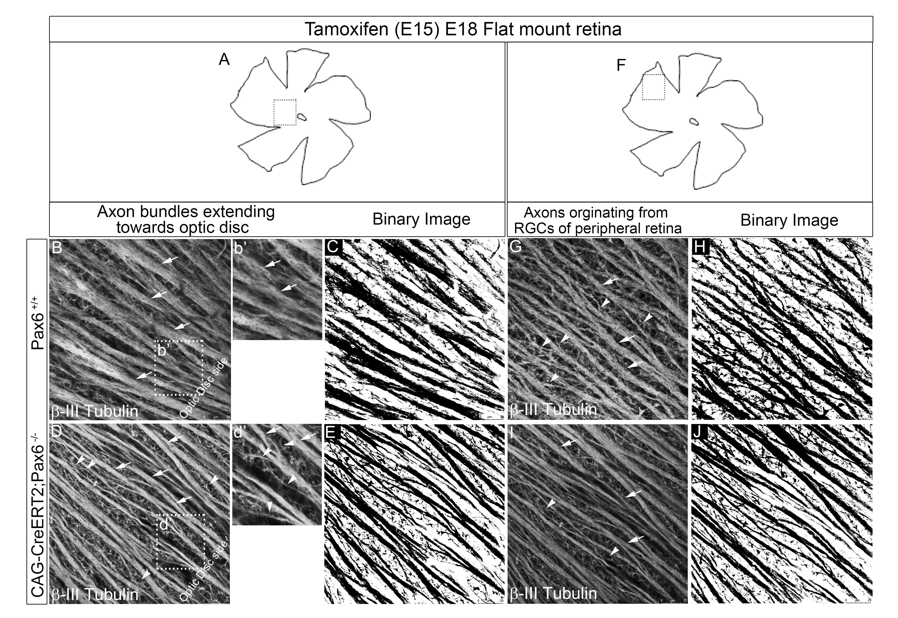

**********
## **Pax6 modulates intra-retinal axon guidance and fasciculation of retinal ganglion cells during retinogenesis**

<p style="color:blue">Lalitha *et al.*.</p>**Scientific Reports** <br>Volume 10, Issue 1<br>September, 2020

### **Abstract**


```{r out.width='50%', echo= FALSE, out.extra='style="float:right; padding:10px"'}

```
<p align = "justify">Intra-retinal axon guidance involves a coordinated expression of transcription factors, axon guidance genes, and secretory molecules within the retina. Pax6, the master regulator gene, has a spatio-temporal expression typically restricted till neurogenesis and fate-specification. However, our observation of persistent expression of Pax6 in mature RGCs led us to hypothesize that Pax6 could play a major role in axon guidance after fate specification. Here, we found significant alteration in intra-retinal axon guidance and fasciculation upon knocking out of Pax6 in E~15.5~ retina. Through unbiased transcriptome profiling between Pax6^fl/fl^ and Pax6^−/−^ retinas, we revealed the mechanistic insight of its role in axon guidance. Our results showed a significant increase in the expression of extracellular matrix molecules and decreased expression of retinal fate specification and neuron projection guidance molecules. Additionally, we found that EphB1 and Sema5B are directly regulated by Pax6 owing to the guidance defects and improper fasciculation of axons. We conclude that Pax6 expression post fate specification of RGCs is necessary for regulating the expression of axon guidance genes and most importantly for maintaining a conducive ECM through which the nascent axons get guided and fasciculate to reach the optic disc.</p>
[<i class="fas fa-download"></i> Download](file:///C:/Users/budha/Documents/bio/files/Lalitha_et_al_2020.pdf)<br>
[<i class="fas fa-link"></i> View Journal Link](https://www.nature.com/articles/s41598-020-72828-4)<br>
[<i class="fas fa-link"></i> View PubMed](https://pubmed.ncbi.nlm.nih.gov/32999322/)


*******


